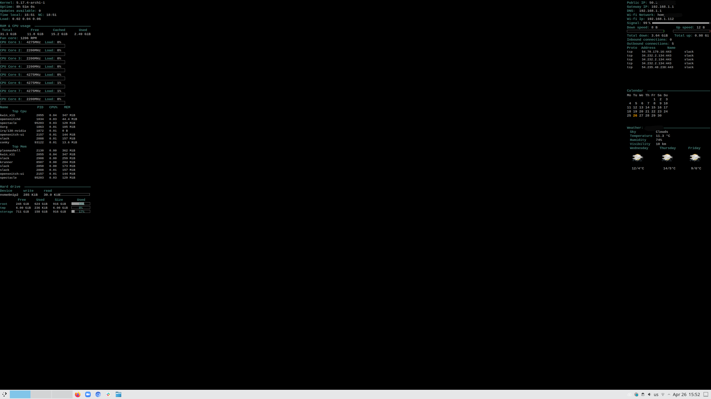

## Conky configuration

Optimized for `3840x2160`

## Installation
- Clone repo `git clone https://github.com/alexbel/conky.git ~/.conky`
- Install dependencies (see below)
- Rename secrets.yml.example to secrets.yml and put your data in it
- Run 'ruby starter.rb' or just './starter.rb'

## Autostart
Kde plasma 5:  
Create a file `conky.desktop` in `~/.config/autostart` directory and fill it in with the following contents:  
```
[Desktop Entry]
Name=conky
Exec=cd ~/.conky && ruby starter.rb
Type=Application
Terminal=false
```

### Dependencies
Required:  
  - curl
  - ss
  - acpi
  - sensors

Conky libs:  
  - conky-imlib2

Weather:  
- Get key from `https://openweathermap.org/api` and add into `secrets.yml`
- find your city_id on `https://openweathermap.org` and add into `secrets.yml`

### Troubleshooting
#### Run `pacman -Sy` without password
Edit `/etc/sudoers` and add:
```
your-user ALL = NOPASSWD: /usr/bin/pacman -Sy
```
